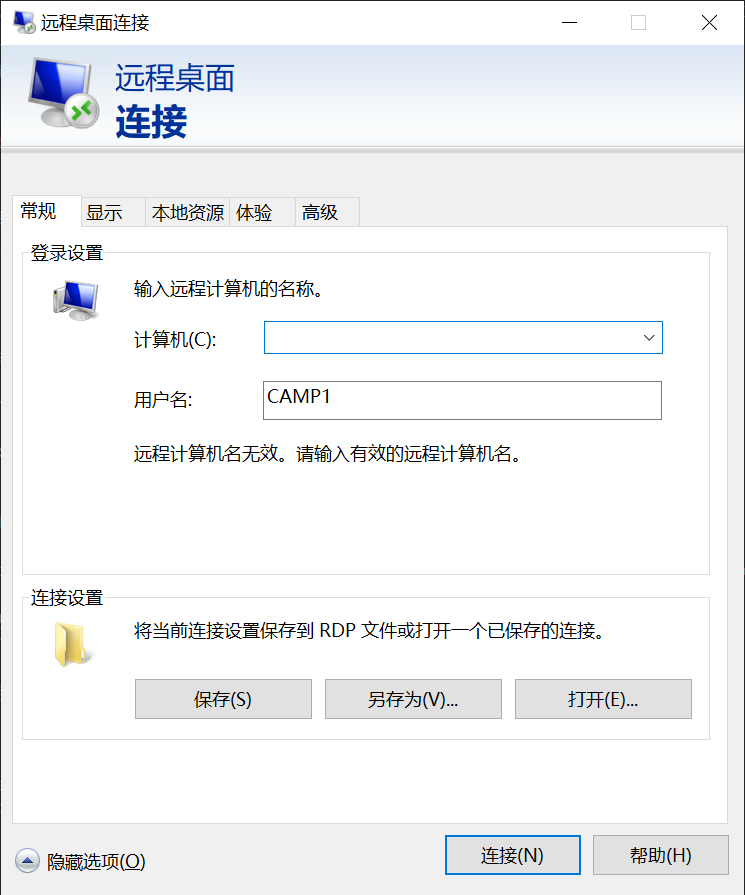
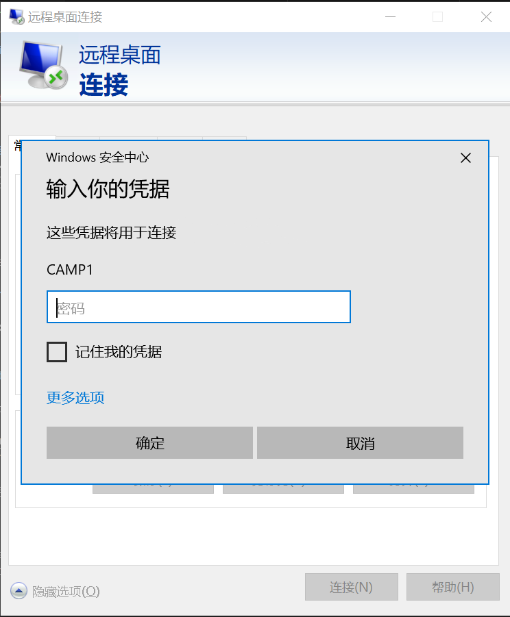
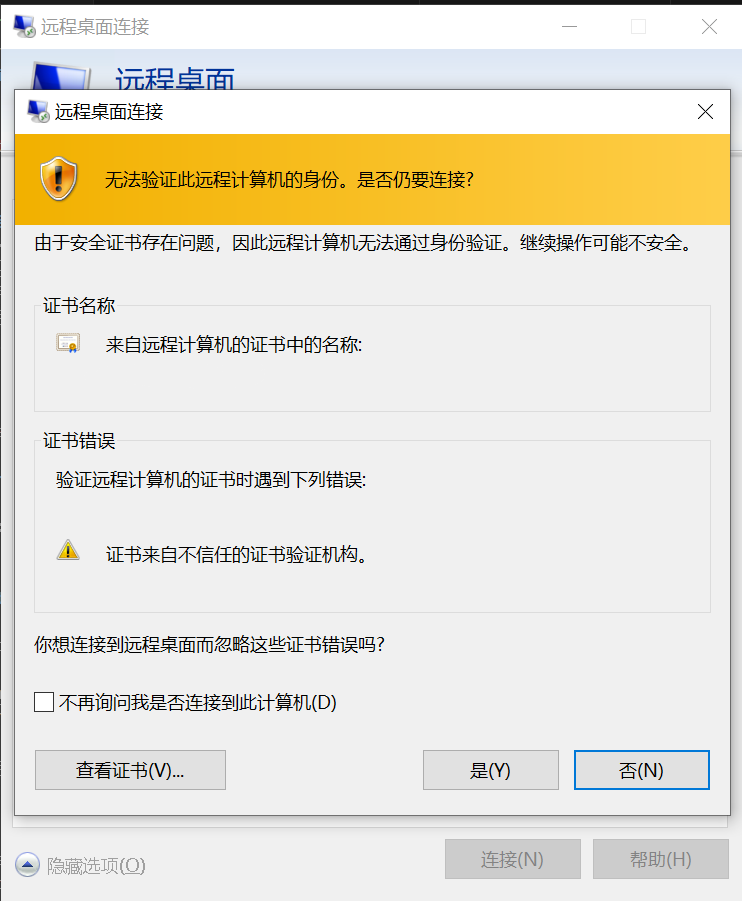
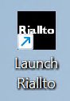
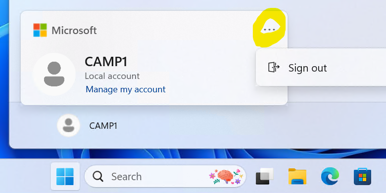

# AIPC Camp Remote Lab Guide

### Get your account
1. Get the IP of the remote lab from your TA
2. The user name would be CAMP1-CAMP10 depend on the account TA assigned to you

### Use Windows RDP to sign in
1. Search RDP and open it. Type in the IP and username.

   

2. Type in the original password.

   

3. Click Yes when you see this pop out

   

4. Then you should be log in

### Open Riallto on your remote Desktop

   
### Log out 
Log out by click the Windows icon and the tree dots and choose sign out.

**Remember: NEVER SHUT DOWN THE REMOTE PC**

### Note:

1. Don't open several notebooks together and execute them all in parallel.
2. Please run the Python command line in each notebook one by one patiently.
3. Please stop the kernel and signout the account
